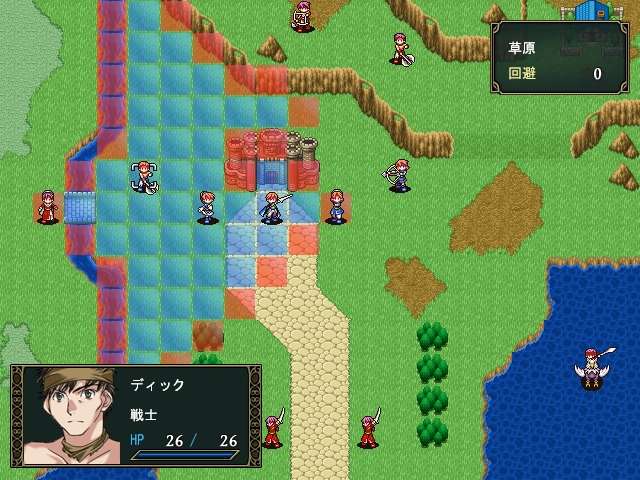
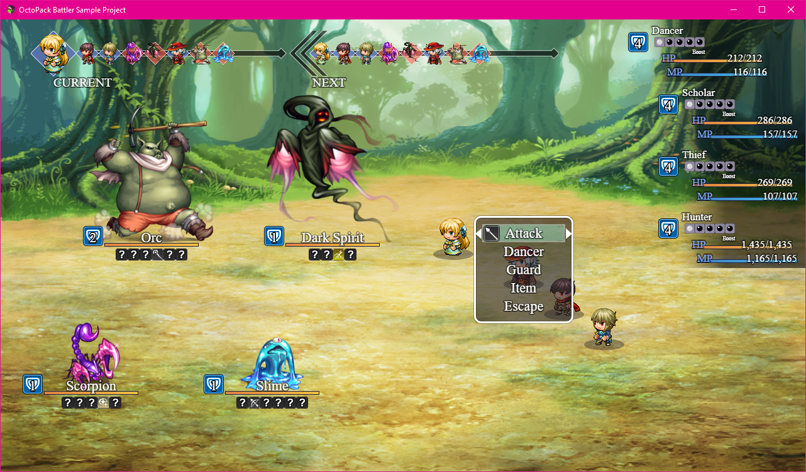
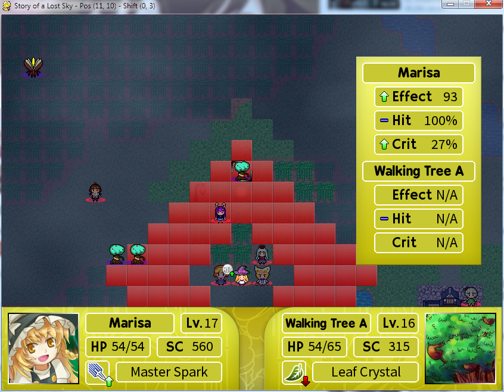

# Project Undecided(定名后请修改)

CAU SKY ACGN Association Development Group(under construction)

Rev. 0.01

##  初衷

在游戏历史上，曾经有一些由大学生自己凭借兴趣开发的游戏，在自己的大学内，甚至是对游戏史，影响深远。比较有代表性的是 "[北大侠客行](http://hk.pkuxkx.com/)"，由北京大学学生开发的一款文字冒险游戏，是国内mud游戏的典范，已经持续免费运营了20多年，至今还有很高的玩家在线率。游戏反映了学生的生活和乐趣，给自己和学校都留下了沉淀和记忆，是非常宝贵的遗产。

中国农业大学校内生活丰富, 小天作为十佳社团之一,成员背景丰富多样, 作为ACG爱好者的同志，如果说这辈子连个像模像样的游戏都没做过，这社团也算是白加了。要是能设计出一个游戏，在我们毕业后也能代代相传，持续运行下去，我们虽然谈不上特别伟大，但是会有一份特殊的荣誉感。

##  目标(随时可修改)

按照群内老哥们提出的几个基本背景设定，设计一款基于火焰之纹章的简洁**SRPG demo** 以吸引更多的志同道合的同伴加入到开发中来。 目前我们希望这款demo大致有两关，地图设计基本成型即可，敌方AI的设计取决于开发平台。

##  开发愿景

九层之台，起于累土。 游戏的开发非一朝一夕即可完成之事，考虑到各位志愿者时间也并不充裕，我们的开发周期以**两周**为一个段落。 版本控制程序是**github**(在代码不能使用的时候帮助我们回溯代码到上一个可用版本)，log文档请务必使用**markdown**语法完成。

##  文件结构

待补全。

[上等人的提案](docs_demo/)

[个人进度记录](log/)

[图片](img/)

##  备选制作工具

1. [SRPG Studio](https://store.steampowered.com/app/857320/SRPG_Studio/)

似乎是一款新晋游戏制作工具，可用于制作类似火纹一样的游戏，可自定义攻击帧，有少量素材附赠，不推荐steam购买因为我们尚且不知道是否会使用这个软件且对质量与后续支持一无所知。建议贴吧解决。

2. [RPG Maker](https://zh.wikipedia.org/wiki/RPG%E8%A3%BD%E4%BD%9C%E5%A4%A7%E5%B8%AB#RPG_Maker_MV)

RM不需要做过多介绍了，VX里面好像把之前的ruby换成了JavaScript。 用这个的毛病是我们要

3. [Pygame](https://www.pygame.org/news)

[平台上唯一一款SRPG，东方系列](https://www.pygame.org/project/1106)

相对于前面两个，Pygame对用户的代码编写能力有更高的要求。Pygame是Python的一个包，包含一些搭建引擎的基本功能，使用这个包意味着我们还要自己开发引擎(弱鸡),周期会加长，灵活度会变大，难度也变大，但是因为并没有自带的素材，所以画面可能更加丑陋。

##  基础教程：

不论是markdown还是github都只是工具，卡太久的话不用就完事了。

[Markdown](https://www.jianshu.com/p/q81RER) 亦或者直接使用任何文本编辑器打开这个README.md文件学习语法即可

[Github](https://guides.github.com/activities/hello-world/)

还有最好的朋友百度。

针对这个项目的github教程如下(读这个足够了):

1.去[git](https://git-scm.com/)的网站下载git。 Download XXXX for windows即可。

2.安装git。

3.使用快捷键WIN+R打开运行程序，输入cmd启动命令提示符:

> C:\Users\Insom>

使用cd指令可移动当前目录(即change directory)：

> cd ..
> C:\Users>

cd ..表示向上一级移动。 

可以键入dir指令来罗列当前路径下的文件：

>C:\Users>dir
>
> Directory of C:\Users
>
>12/29/2018  01:22 PM    <DIR>          .

>12/29/2018  01:22 PM    <DIR>          ..

>03/18/2019  11:20 PM    <DIR>          Insom

>12/30/2018  05:18 AM    <DIR>          Public

>               0 File(s)              0 bytes

>               4 Dir(s)  326,636,441,600 bytes free

输入cd [文件夹名]移动到想去的文件夹

>C:\Users>cd Insom

如果不想打全可以按tab，会自动补全文件名字。

接下来进入到github部分。使用上述方发移动到你想去的文件位置，键入

>git clone https://github.com/cau-sky/place_holder.git

来克隆这个项目的文档和代码。进入到这个文件夹内，修改你想修改的文件，保存。

如果你是第一次使用git，你需要设置你的账号:

> git config --global user.name "John Doe"
> git config --global user.email johndoe@example.com

邮箱替换成你注册github的邮箱。

在place_holder根目录输入:

> git add --all

来加入你修改的文件

> git commit -m "commit info"

来上交你的文件，commit info部分替换为你对此次更改的描述。最后，使用

> git push

将你的文件推送至服务器端。

**每次**使用 git push前，**一定**要使用

> git pull

同步你的本地文件和服务器端文件，避免有他人改动。

日后我们经常使用的也只有这几个命令，如果过于繁复，那也可以不用，直接去https://github.com/cau-sky/place_holder.git 下载压缩包，解压缩后在文件夹内右键点选git bash here，重复git add --all之后的步骤即可。

